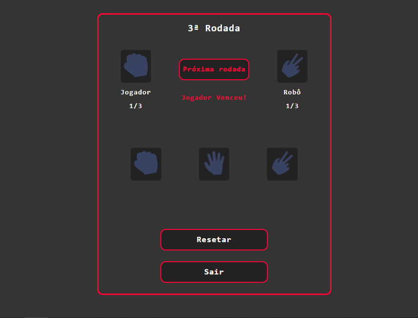

# Pedra Papel Tesoura
 ##### O presente projecto é o jogo  Pedra, Papel e Tesoura criado com finalidade de aprimorar a lógica de programação e habilidades front-end.
 #### Acesse o jogo [clicando aqui](https://franciscojunior12.github.io/Pedra-Papel-Tesoura/)
 
 ## Tecnologias Usadas

  

  
  
  
